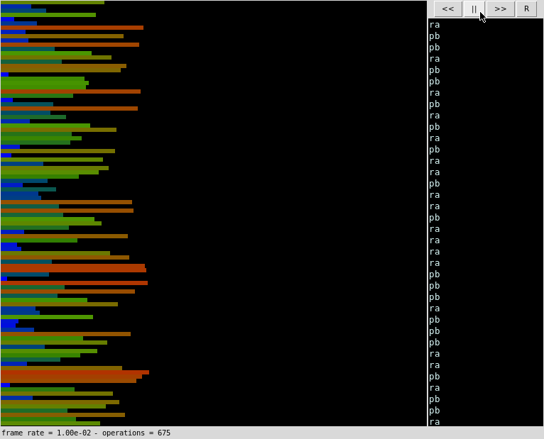

# Push_swap - sorting algorithm with stacks

This project introduces us to complexity and gives us more challenging algorithms to tackle. The program is provided with a random sequence of numbers and needs to order the stacks in the minimum amount of moves possible. Availables moves are push, swap and rotate. The lesser the amount of moves, the higher your grade!

The bonus portion of the project tasks us to implement a checker program which validates whether the moves generated by your push_swap actually order the given vector.

One of our fellow students at 42, [paulahemsi](https://github.com/paulahemsi) developed a [game](https://phemsi-a.itch.io/push-swap) where you can test-drive the available moves in a graphical environment. Give her a thumbs up if you like it!

Here's a graphical representation of my own algorithm in action:

Python script used to generate the visualizer was created by [o-reo's](https://github.com/o-reo) [push_swap visualizer](https://github.com/o-reo/push_swap_visualizer)

- - -

## Available moves

The moves are also coded by the students, you may implement these in an array, linked list or other variants such as circular or doubly linked lists.

#### Push (pa / pb)
Pushes the first element of the given stack to the other.

#### Swap (sa / sb / ss)
Swaps the first and second element of the given stack.

#### Rotate (ra / rb)
Puts the first element of the given stack at its bottom.

#### Reverse rotate (rra / rrb / rrr)
Puts the last element of the stack at the top.

## What i learned?

This project is very unique in its own way. It introduces us to more complex algorithms and gives a glimpse of what to expect and look out for when pursuing a career specialized in that area of expertise.

On one side it does not give you an idea on how vectors are ordered in real life, as existing sorting algorithms do not work with a stack and a small amount of arbitrary movements. Since most students come to the school with an empty glass our first implementation is often a naive one, only to find out that your solution takes 90 thousand moves or more to come up with an ordered stack.

To improve your algorithm you need to study various others and implement portions of them that work with the given set of rules. My algorithm, for example, has its first half -- from A to B -- inspired in quick sort and the second portion -- from B to the bottom of A -- in selection sort, as you can see on the gif above.

It is also interesting to see how small decisions in your algorithm impact performance in a big way. If you try to order thousands of numbers a single is_sorted check can add minutes to the calculation time. So this is also a good exercise in algorithms architecture.

You could keep on creating algorithms and try to beat your own marks. Or even try to simulate different algorithms within the boundaries of the rules. Perhaps the me of the future will tackle the challenge again at some point, with an improved set of skills!

## My badge

## My grade

In order to get a highest grade your algorithm needs to order a 100 numbers in less than 700 moves. And 500 in less than 5500.

## Requirements

* linux with GCC and make

If necessary, install these with:

`sudo apt-get update && sudo apt-get install gcc make`

## How to use

Clone the repository:

`git clone --recurse-submodules https://github.com/VLN37/push_swap`

Compile the program with:

`make complete`

To run push_swap you need to provide it with a random list of numbers that has no duplicates. As in the example below:

`./push_swap 9 3 8 5 2`

You may generate a bigger list with the following command:

`./push_swap $(seq 0 99 | shuf)` to give you the instructions and `./push_swap $(seq 0 99 | shuf) | wc-l` to give you the number of moves that sort it

`ARG=$(seq 0 99 | shuf); ./push_swap $ARG | ./checker $ARG` to test the bonus checker

To give the checker your own list of moves you can:

`./checker 3 1 2` and input the moves you want.

## License

This project is licensed under GPL3, [available here](LICENSE)
